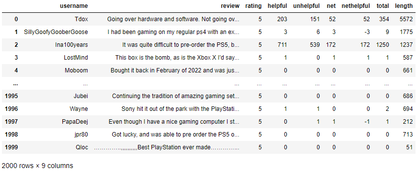

# Data 200: Database Systems and Data Management for Data Analytics


# Take-Home Final Exam

**Dickinson College**<br/>
**Fall 2022**<br/>
Prof. Eren Bilen<br/>
<font color='red'>**Due Date:** Friday December 16, 12pm (noon) </font>
---
Enter your name in the markdown cell below.

# Name:


```python
from selenium import webdriver
import pandas as pd
import re
import time 
import random
import matplotlib.pyplot as plt
```

# Scraping task

On this exam, you will scrape reviews from BestBuy.com. The item for which you will scrape reviews for will depend on the first letter of your last name. Check the table below (both letters inclusive) for your assigned item:

|First letter of your last name | Item/link to reviews on BestBuy.com
| :---        |    :---   |
|A-G | https://www.bestbuy.com/site/reviews/microsoft-xbox-series-x-1tb-console-black/6428324?variant=A&skuId=6428324
|H-M | https://www.bestbuy.com/site/reviews/apple-airpods-with-charging-case-2nd-generation-white/6084400?variant=A&skuId=6084400
|N-S | https://www.bestbuy.com/site/reviews/samsung-65-class-7-series-led-4k-uhd-smart-tizen-tv/6401722?variant=A&skuId=6401722
|T-Z | https://www.bestbuy.com/site/reviews/nintendo-switch-32gb-lite-turquoise/6257139?variant=A&skuId=6257139


Your goal is to scrape 2,000 reviews that were posted in the reviews page of your assigned item. The format of your output should be a dataframe with the following columns/format:
<br>


where
```
username: the user name of the reviewer
review: the review content
rating: the rating (out of 5) left by the reviewer
helpful: the number of votes received on the review indicating that the review is helpful
unhelpful: the number of votes received on the review indicating that the review is unhelpful
net: |helpful - unhelpful| i.e., the absolute value of the difference between "helpful" and "unhelpful" votes
nethelpful: helpful - unhelpful i.e., the difference between "helpful" and "unhelpful" votes
total: total number of votes (helpful + unhelpful) received
length: length of the review, defined as the number of characters in a review (including whitespace)
```

Include the `.ipynb` and `.md` versions of your work + the following two scatterplots as part of your output. Comment on what you observe from the scatterplots. Are you surprised?
* scatterplot with `length` on the x axis, `total` on the y axis
* scatterplot with `length` on the x axis, `nethelpful` on the y axis

Commit and push on Github once you finish.

Hints: 
* You will need to scrape multiple pages. Make sure to wait at least 2 seconds between each page, e.g., using `time.sleep(random.uniform(2, 3))`.
* Trim away `\n` from review strings as it contains no useful information, and can cause bugs in regex.
* Make sure to get the position of the "next Page" button, as its position can change dynamically depending on the page number.

Good luck!


```python

```
